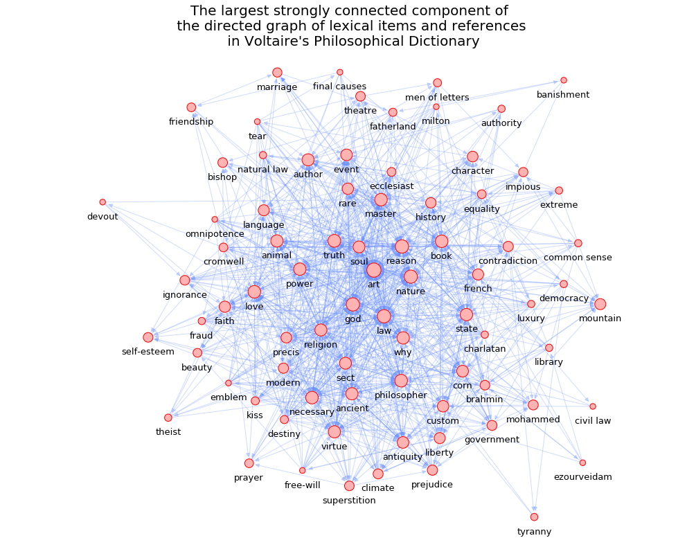

# Mapping-the-Networks-of-Voltaire-s-Philosophical-Dictionary
## Findings

The first step in this project was to modify Voltaire’s Philosophical Dictionary and divide it into 99 sub parts based on the lexical terms it contained. The division into sub parts was accomplished by using special character to separate one section from the other. From that we derived a Python dictionary constituting of lexical terms as the keys and their corresponding sub texts as the values. The next step was to look for references to other lexical term in each of the sub texts. 
If a reference to any other lexical term was found in the sub text, we formed a directed edge with the title/term of the sub text pointing to the referenced lexical term. In this way we formed the graph of lexical terms and references in Voltaire’s Philosophical Dictionary. From this graph, we then derived the largest strongly connected component.

Shown below is the directed graph of lexical items and references in Voltaire’s Philosophical Dictionary.

Voltaire's Philosophical Dictionary graph has 99 nodes (lexical items) and 1136 edges (references among lexical items) .
* It is a directed, simple graph.
* This graph is not strongly connected and has 21 strongly connected components.
* It is weakly connected graph and hence, has no isolates.
* The density, transitivity and reciprocity of this graph are 0.117, 0.322 and 0.146, respectively.

The largest strongly connected component of Voltaire’s Philosophical Dictionary graph has the following diagnostics:

* It has 79 nodes (lexical items) and 930 edges (references among lexical items).
* Its density, transitivity and reciprocity are  0.151, 0.324 and 0.178, respectively.
* The diameter of the largest strongly connected component of Voltaire's Philosophical Dictionary graph is 5.

Through the use of NLTK (Natural language toolkit), we extracted the names of characters and locations. So, our total vocabulary of dictionary terms consists of 3 categories: (1) character names, (2) locations and (3) lexical terms. 

Below we are displaying the top dictionary terms from each category and the wordclouds of all dictionary terms in each category:

Finally, we have computed 10 centrality indices of the nodes of the dictionary items in Voltaire’s Philosophical Dictionary. The 10 top items sorted with respect to degree centrality have the following values of centrality indices:

.png)
